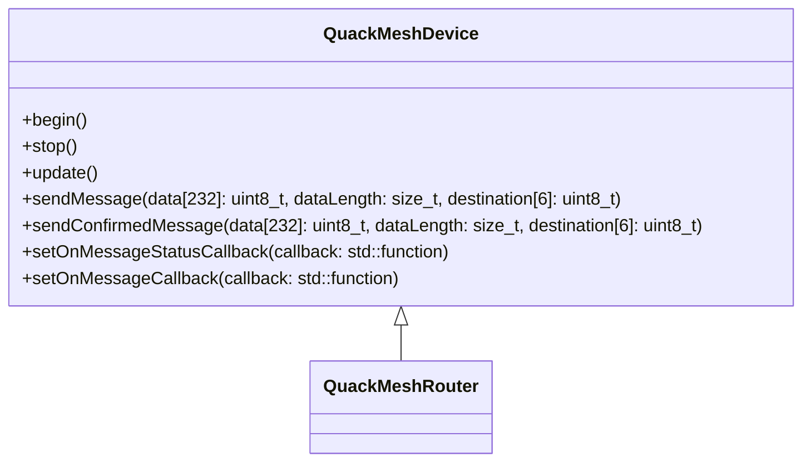
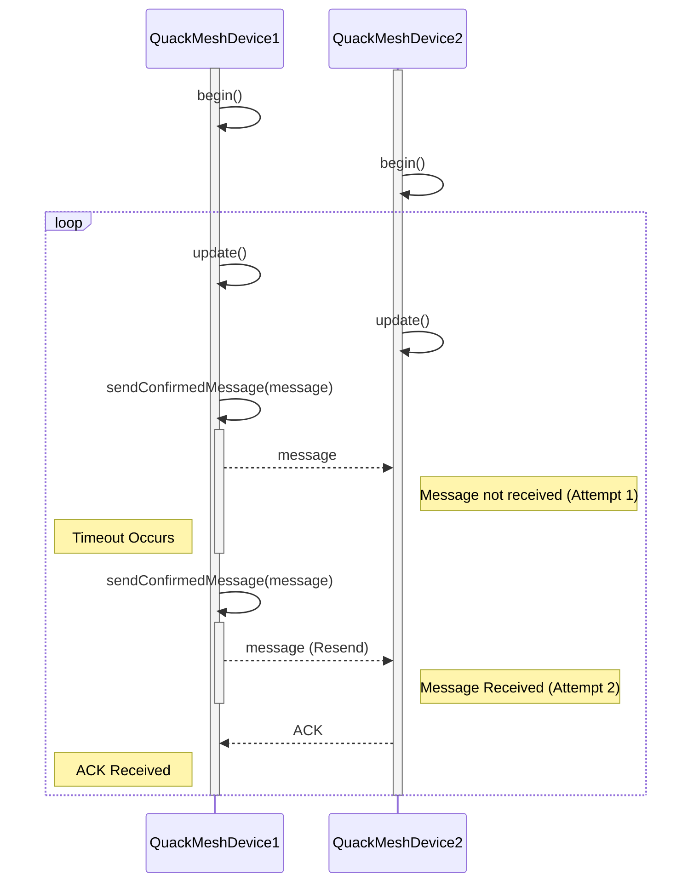

[](https://opensource.org/licenses/MIT)
[](https://www.espressif.com/)

<p align="center">
  
</p>
<p align="center">
  <h1 align="center">QuackMesh</h1>
  <p>A simple and efficient mesh communication protocol built on top of the ESP-NOW protocol for ESP32 and ESP8266 microcontrollers. 
    It provides a simple, Arduino-style interface for creating self-organizing, decentralized networks, ideal for IoT projects and remote control applications.</p>
</p>

## Key Features

- **Mesh Networking:** A custom protocol based on ESP-NOW enables communication between multiple distributed devices, extending range and providing redundancy and fallback routes.
- **Router and End-Device Support:** Designates devices as either routers (forwarding messages, routing tables) or end devices (only sending and receiving), optimizing network performance and resource usage.
- **Uni- and Broadcast Messaging:** Supports sending messages to a specific device (unicast) or all devices in the network (broadcast).
- **Message Acknowledgements:** Provides reliable delivery of messages through an acknowledgement mechanism that features [Automatic repeat request](https://en.wikipedia.org/wiki/Automatic_repeat_request).
- **Application-Layer Protocol Agnostic:** The custom protocol supports any application-layer message format (e.g. plain text, json, etc).
- **Self-healing and intelligent routing:** Through self-updating routing tables, the network can adapt itself to topology changes and choose the quickest routes through the network.
- **Non-Blocking API:** Allows for seamless integration with other tasks and avoids blocking the main program loop.
- **Arduino-Style:** Provides an easy-to-use API familiar to Arduino developers.

## Getting Started
Since this project does not have any external dependencies except the Arduino framework, to get started all you need is an Arduino-based project and the source code. 
Clone the repository with `git clone`, place it in your preferred location, include the necessary files in your project, and you're ready to begin.

## Usage
This library features two client components:



First, `QuackMeshDevice` is an end-device client that does not take part in routing and message forwarding. This is perfect for devices that are on limited power, because they don't need to stay turned on and can only power up if needed (e.g. for sending a message).
```cpp
QuackMeshDevice device;

// Initialize the device and attach callbacks
void begin()
{
  device.begin()
  // Set a callback for received messages
  device.setOnMessageCallback(std::function<void(uint8_t type, const uint8_t srcAddress[6],
                           const uint8_t *data, size_t dataLength)>)

  // Set a callback for messages that require acknowledgment
  device.setOnMessageStatusCallback(std::function<void(int)>)
  
}

// Continiously update the device client, without blocking the main update loop
void loop()
{
  device.update()
}
```

Sending messages support two modes:

1. To send unconfirmed messages, call 
```cpp
sendMessage(uint8_t data[232], size_t dataLength,
                   uint8_t destination[6]
```

2. To send confirmed messages that require an acknowledgment, call
```cpp
sendConfirmedMessage(uint8_t data[232], size_t dataLength,
                            uint8_t destination[6]);
```

Second, `QuackMeshRouter` is a router-device client that does routing and message forwarding in the mesh network. This is best suited for devices that are continiouslly powered and have enough processing power and storage available. Since every `QuackMeshRouter` is also a `QuackMeshDevice`, all the public api is the same.

### Reliability
Reliability is guaranteed on two levels. First, the underlying ESP-NOW protocol supports reliable message transfer on the network layer. Second, to provide reliability between applications running on devices, the custom protocol features acknowledgements. 




## Limitations
- This project is still a WIP and is not recommended for production use.
- The clients provide **best-effort** delivery guarantees but are not perfect.
- Currently, encryption is expected to happen at the application level; therefore, any messages sent through Quack must not contain sensitive data.
- You use the clients at your own risk    

## Contributing
If you have any ideas or suggestions, feel free to open an [Issue](https://github.com/valentinpurrucker/quackmesh/issues). Other contributions are currently not supported.  

## License
This repository is under the [MIT](https://opensource.org/license/mit)-License.
